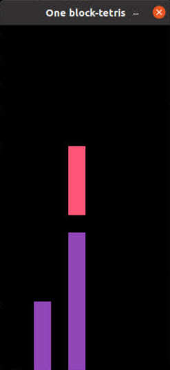
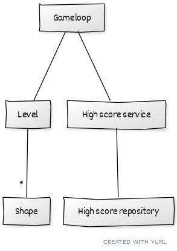
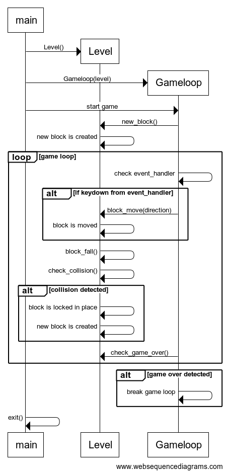

## Arkkitehtuurikuvaus

### Käyttöliittymä

Pelissä on tällä hetkellä vain yksi näkymä - pelikenttä, jossa pelaaja voi liikuttaa palikoita. Pelikenttä sulkeutuu automaattisesti, kun peli päättyy.

Tarkoitus on laajentaa käyttöliittymää niin, että pelaaja näkee pelin aikana seuraavan palikka ja omat pisteet, sekä lisätä erillinen Game over -näkymä, jossa pelaaja voi halutessaan aloittaa pelin uudestaan.

### Sovelluslogiikka

Sovelluksen loogisen tietomallin muodostavat Gameloop-, Shape- ja Level-luokat. Shape-luokka luo ja käsittelee aktiivista (laskeutuvaa) palikkaa, Level-luokka ylläpitää pelikenttää ja lukittuja palikoita. Gameloop-luokka pyörittää pelisilmukkaa ja välittää pelaajan syötteet Shape- ja Level-luokille.

### Päätoiminnallisuudet

##### Pelisilmukka

