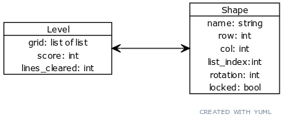
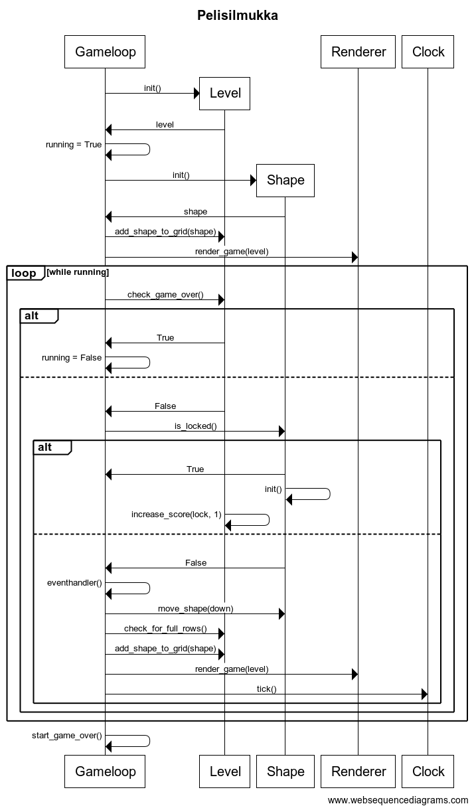
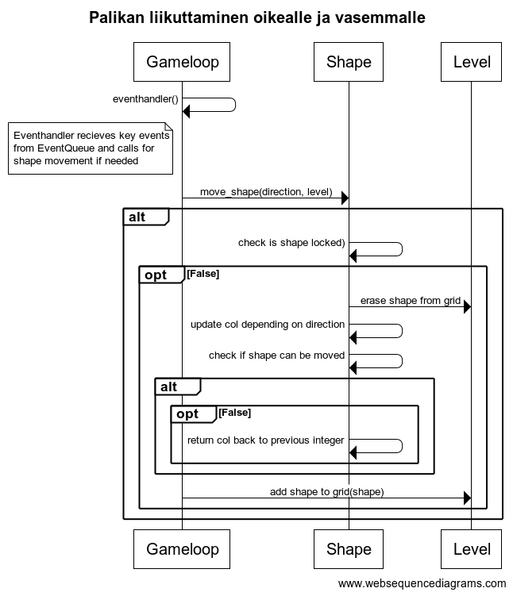

## Arkkitehtuurikuvaus

### Rakenne

Sovellus koostuu neljästä kerroksesta: käyttöliittymä, sovelluslogiikka, pelisilmukka ja tiedon pysyväistallennus. Koodin pakkausrakenne on seuraava:

Pakkaus ui sisältää käyttöliittymästä, gameloop pelisilmukasta, game logic sovelluslogiikasta ja repositories tietojen pysyväistallennuksesta vastaavan koodin.

### Käyttöliittymä

Käyttöliittymässä on neljä erillistä näkymää:

* Aloitusnäkymä : [StartView](https://github.com/EssiPry/ot-harjoitustyo/blob/main/src/ui/start_view.py)
* Pelinäkymä: [GameView](https://github.com/EssiPry/ot-harjoitustyo/blob/main/src/ui/game_view.py)
* Pelin lopetus näkymä: [GameOverView](https://github.com/EssiPry/ot-harjoitustyo/blob/main/src/ui/game_over_view.py)
* Tulosnäkymä: [HighScoreView](https://github.com/EssiPry/ot-harjoitustyo/blob/main/src/ui/high_score_view.py)

Jokainen näkymä on toteutettu omana luokkanaan. Aloitus-, peli- ja tulosnäkymät ovat erillisiä, pelin lopetus näkymä piirtyy pelinäkymän päälle pelin loputtua. Gameloop- ja renderer -luokat vastaa näkymien kutsumisesta käyttäjäsyötteen perusteella. UI-kansion luokat vastaavat näkymien piirtämisestä yhdessä renderer -luokan kanssa.

### Sovelluslogiikka

Sovelluksen loogisen tietomallin muodostavat [Shape](https://github.com/EssiPry/ot-harjoitustyo/blob/main/src/game_logic/shape.py)- ja [Level](https://github.com/EssiPry/ot-harjoitustyo/blob/main/src/game_logic/level.py)-luokat. Shape-luokka luo ja käsittelee aktiivista (putoavaa) palikkaa, Level-luokka ylläpitää tietoa sen hetkisestä pelistä ja -kentästä: putoavan palikka, lukitut palikat, täydet rivit, pisteet.

Shape-luokka tarjoaa käyttöliittymän toiminnoille omat metodit:

* `move_shape(direction, level)`
* `rotate_shape(level)`

Gameloop-luokka kokoaa yhteen pelilogiikan, käyttöliittymän ja käyttäjäsyötteet.

### Tietojen tallennus

ScoreRepository -luokka huolehtii tulostietojen tallentamisesta SQLite-tietokantaan. Saatu pistemäärä tallennetaan aina pelin päättymisen jälkeen. High Score View -näkymä näyttää käyttäjälle 5 parasta tulosta.

Tulokset tallennetaan SQLITE-tietokannan tauluun Score, joka alustetaan initialize_database.py -tiedostossa.

### Päätoiminnallisuudet

Kuvataan pelin toimintalogiikan muutaman toiminnallisuuden osalta sekvenssikaavioina.

#### Pelisilmukka

#### Palikan liikuttaminen oikealle tai vasemmalle

### Ohjelman rakenteeseen jääneet heikkoudet

Peliin voisi lisätä Game-luokan, joka huolehtii meneillään olevan pelin pisteiden ja poistettujen rivien laskemisesta ja ylläpidosta Level-luokan sijaan. Tähän uuteen luokkaan voisi lisätä esimerkiksi pelin vaikeustasosta huolehtimisen tulevaisuudessa.

Graafisen käyttöliittymän koodin olisi voinut jakaa selkeämmin. Nyt Gameloopin renderer-luokka on nimetty hiukan hämäävästi, sillä UI-kansion luokat hoitavat varsinaisen piirtämisen ja renderer-luokka vain kutsuu oikeita metodeja. Lisäksi graafisessa käyttöliittymässä on jonkin verran toisteista koodia. UI-kansiion olisi voinut lisätä apumetodi-luokan, josta varsinaiset näkymät kutsuvat metodeja, jotka toistuvat useissa näkymissä. Nyt pylint ilmoittaa toisteista koodista high_score_view - ja start_view -luokissa.
