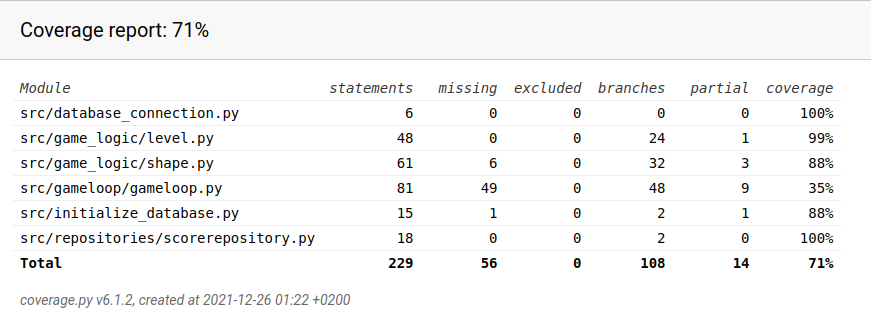

## Testaus

Peliä on testattu automatisoiduilla yksikkö- ja integraatiotesteillä. Järjestelmätestaus ja käyttöliittymän testaus on tehty manuaalisesti.

### Yksikkö- ja integraatiotestaus

#### Sovelluslogiikka

Pelilogiikasta vastaavia Level- ja Shape-luokkia testataan [TestLevel](src/tests/level_test.py)- ja [TestShape](src/tests/shape_test.py) -testiluokilla.

#### Repositorio-luokat

Pelin pysyväistallennusta testataan [TestScoreRepository](src/test/score_repository_test.py) -luokalla. Luokkaa testataan ainoastaan testeissä käytössä olevalla tiedostolla, jonka nimi on konfiguroitu .env.test-tiedostoon.

#### Testikattavuus

Pelin testauksen haarautumakattavuus on 71%.

Testikattavuuden ulkopuolelle on jätetty build.py- ja config.py -tiedostot, UI-kansion käyttöliittymäluokat, sekä Gameloop-kansion Clock-, EventQueue- ja Renderer-luokat.

Gameloop-luokan testaus jäi alhaiseksi (35%), sillä luokasta testataan ainoastaan event_handler -metodia. En valitettavasti keksinyt miten luokan muita metodeja olisi saanut testattua automaattisesti, sillä testit jäivät loputtomiin silmukoihin. Gameloop-luokkaa testattiin manuaalisesti ja varmistettiin, että näkymien vaihto sekä palikoin liikuttaminen ja kääntäminen onnistuu.

### Järjestelmätestaus

Pelin järjestelmätestaus on suoritettu manuaalisesti.

#### Asennus ja konfigurointi

Peli on haettu ja sitä on testattu käyttöohjeen kuvaamalla tavalla Linux-ympäristössä. Testauksessa on käytetty eri konfiguraatioita .env-tiedoston kautta.

Peliä on testattu tilanteissa, jossa pistetulokset tallentava tiedosto on olemassa ja jossa sitä ei ole, jolloin peli on luonut sen itse, kun komento
`poetry run invoke build` suoritettu ennen pelin aloitusta.

#### Toiminallisuudet

[Määrittelydokumentissa](https://github.com/EssiPry/ot-harjoitustyo/blob/main/dokumentaatio/vaatimusmaarittely.md) listatut toiminallisuudet on käyty läpi ja todettu toimiviksi useamman testaajan toimesta.

### Sovellukseen jääneet laatuongelmat

* Gameloop -luokkaa pitäisi muokata, jotta automaattitestaus olisi mahdollista.
* Peli  kaatuu, eikä tulosta järkevää virheilmoitusta jos `poetry run invoke build` komentoa ei suoriettu ennen pelin alkua ja käyttäjä yrittää mennä tulosnäkymään.